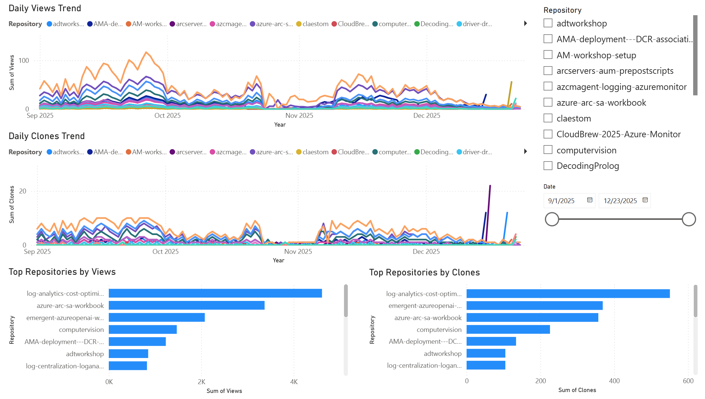
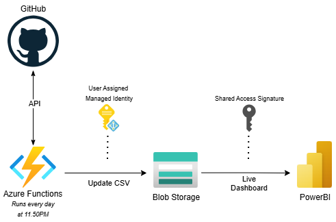
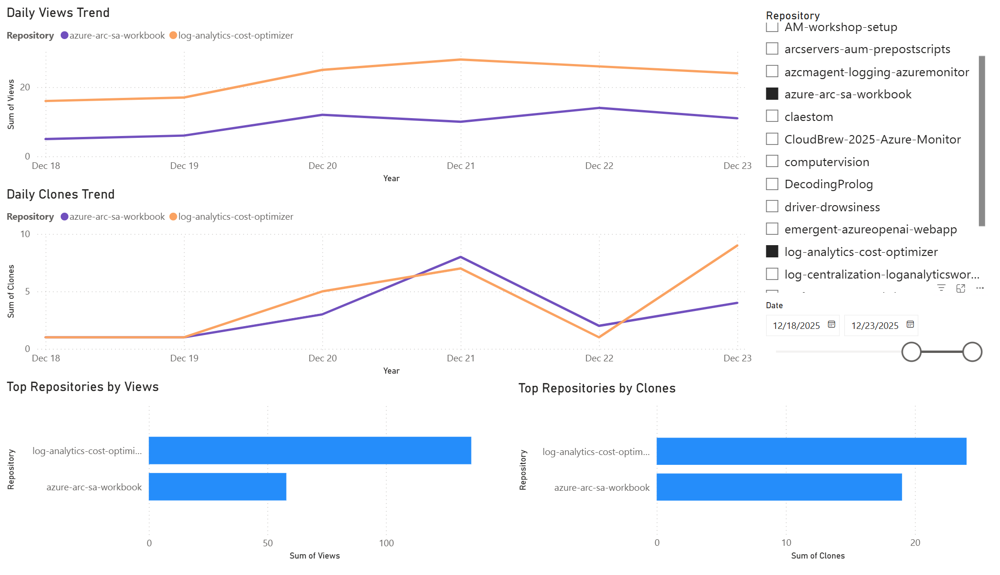
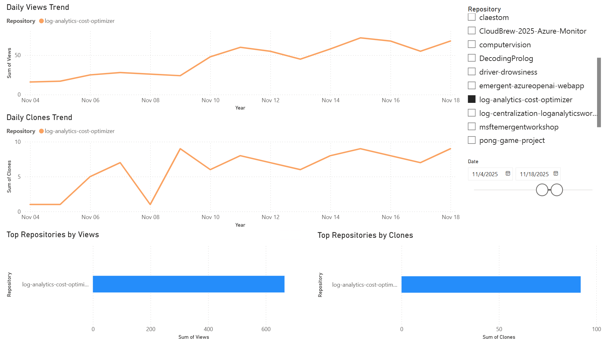

# GitHub Traffic Analytics

Track GitHub repository traffic (views and clones) over time. GitHub only exposes the last 14 days; this tool captures the latest data each day before it’s purged, appends it to a central CSV in your storage account, and preserves the history so you can analyze older traffic for free.

## What It Does

- Fetches **views** and **clones** data for all your public repositories
- Stores historical data (GitHub only keeps 14 days) 
- Captures data daily before GitHub purges it, keeping a continuous history
- Outputs: CSV with date columns showing `views(clones)` per repository. [Sample output here.](./outputs/sample.csv)
- Visualize metrics in a PowerBI report, with filters to drill into a single repo or any selection



## Usage Options

### Get the code

```powershell
# Clone and enter the repo
git clone https://github.com/claestom/github-traffic-analytics.git
cd github-traffic-analytics
```
### Option 1: Azure Functions (automated)

Deploy to Azure for fully automated daily collection at 11:50 PM CET.

**Prerequisites:**
- Azure subscription
- Azure CLI installed
- PowerShell 7.4+

**Deploy:**

Tip: Copy-paste the script into a text editor, fill in the values, then run it as a whole from inside the `github-traffic-analytics` folder.

```powershell
# 1. Login to Azure
az login

# 2. Set variables
$rg = "<rg-name>"
$location = "<region of deployment>"

# 3. Create resource group
az group create --name $rg --location $location

# 4. Deploy infrastructure (storage, function app, identity)
az deployment group create `
  --resource-group $rg `
  --template-file infra/main.bicep `
  --parameters infra/main.bicepparam

# 5. Get function app name from outputs
$funcApp = az functionapp list -g $rg --query "[0].name" -o tsv

# 6. Set GitHub credentials in the Azure Functions config
az functionapp config appsettings set -g $rg -n $funcApp `
  --settings GITHUB_TOKEN="ghp_new_token" GITHUB_USERNAME="your_username"

# 7. Publish function code
cd azure-function
$env:FUNCTIONS_WORKER_RUNTIME = "powershell"
$env:FUNCTIONS_WORKER_RUNTIME_VERSION = "7.4"
func azure functionapp publish $funcApp --nozip --powershell 
```

**What Gets Created:**
- Storage Account (stores CSV in `metrics` container)
- Function App (PowerShell 7.4, Consumption plan)
- User-Assigned Managed Identity (secure storage access)
- Application Insights (monitoring)

**Architecture:**

<p align="center">
  
</p>

### Option 2: Local Script

Run manually or via scheduled task on your local machine.

**Setup:**
```powershell
# 1. Create .env file in root directory
GITHUB_TOKEN=ghp_your_token_here
GITHUB_USERNAME=your_username

# 2. Run the script
cd src
.\github-traffic-metrics.ps1
```

**Output:** `outputs/github-traffic-metrics.csv`

**Schedule (optional):**
- Windows: Task Scheduler
- Linux/Mac: cron job

## Power BI Usage (SAS + .pbit)

Use the template in [`powerbi/`](./powerbi/prodreport-realtime.pbit) to visualize the CSV with your own storage.

**Generate a blob SAS:**


- Scope: blob-level, permissions: `r` (read only), set expiry date.

- Desktop setup:
  - Open the `.pbit` → enter the SAS URL when prompted.
  - Data source credentials: choose `Anonymous` (SAS is in the URL).
  - Refresh to apply all existing transform steps.
- Publish to Service:
  - Dataset → Settings → Data source credentials → set to `Anonymous` for the blob domain.
  - Enable Scheduled refresh (ensure SAS expiry is sufficient).
- SAS scope: prefer blob-level SAS with `r` permission only; rotate with brief overlap.

## Common Use Cases
- Overall insights across repositories: use the line chart with `Date` on the X-axis and `Views`/`Clones` as values; leave the `Repository` slicer empty to see totals.
- Single repository focus: select one repo in the `Repository` slicer; visuals filter to that repo’s traffic only.
- Specific time period: use the `Date` slicer (Between) to limit visuals to a range (e.g., last 7 days).
- Example: Understand activities after a release window: pick the repo in the slicer and set the `Date` slicer to the release week to analyze impact.

### Examples

##### Overall insights across repositories


##### Traffic for two repos for a specific time period



##### Analyze traffic after new release (use of time range and repo filter)



## Roadmap

Planned enhancements to deepen traffic insights:

- **Unique Views & Clones**: Track distinct visitors and unique IPs alongside total metrics to measure repeat engagement.
- **Referring Websites**: Capture traffic sources (Twitter, Reddit, blogs, search engines) to measure campaign impact.

The CSV-based approach ensures backward compatibility while unlocking richer insights.

## Contributions

Contributions are always appreciated! Open an issue to report bugs or suggest features, or submit a PR to improve the code.

Cheers